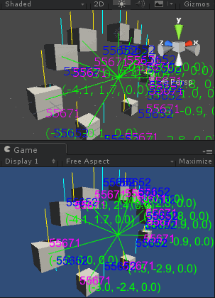

# Unity3d Runtime Debug Draw

Single file debuging DrawLine/DrawText/etc that works in both Scene/Game view, also works in built PC/mobile builds.

## Features

* Draw debug lines in built players.
* Additional goodies like draw text, attach texts and else.
* Good old single file library.
* Calls can be easily compiled away in release builds.

## Usage

Download [RuntimeDebugDraw](Assets/RuntimeDebugDraw.cs) and drop it into your project and you're done. Remember to read the header comments or it might work as intended.

## License

Public Domain

## TODOs/Bugs/Known Issues

* Only tested on Unity 5.3 for now.
* Performance has room for improvement.
* Doesn't work well with camera post processing.
* Draw CapsuleCollider/Mesh/etc.
